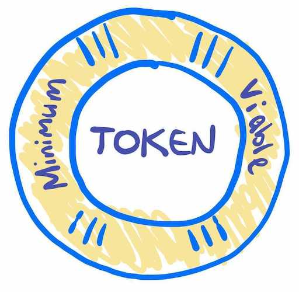

`make` will do anything you could possibly need it to, if you just believe.

---

This repo represents the Minimum Viable Everything [DAO](https://ethereum.org/en/dao/) - Decentralized autonomous organization.

We manage the MVT - the only coin you'll ever need.

This repo is written using Solidity source code, which is used to create smart contracts for blockchain transactions. Solidity is utilized by several blockchain platforms, such as Ethereum, Tendermint, and Counterparty.

[solidity VSCode Extenstion](https://marketplace.visualstudio.com/items?itemName=JuanBlanco.solidity) - Ethereum Solidity Language for Visual Studio Code

## This codebase

### `contracts/`:

Where we configure our token and contracts.

We include `solidity` and `openzeppelin/ERC20` contract. 

- `Migration.sol`
- `MVE.sol`

### `migrations/`:

Config related to our token.

- `1_initial_migration.js`
- `2_deploy_contracts.js`
